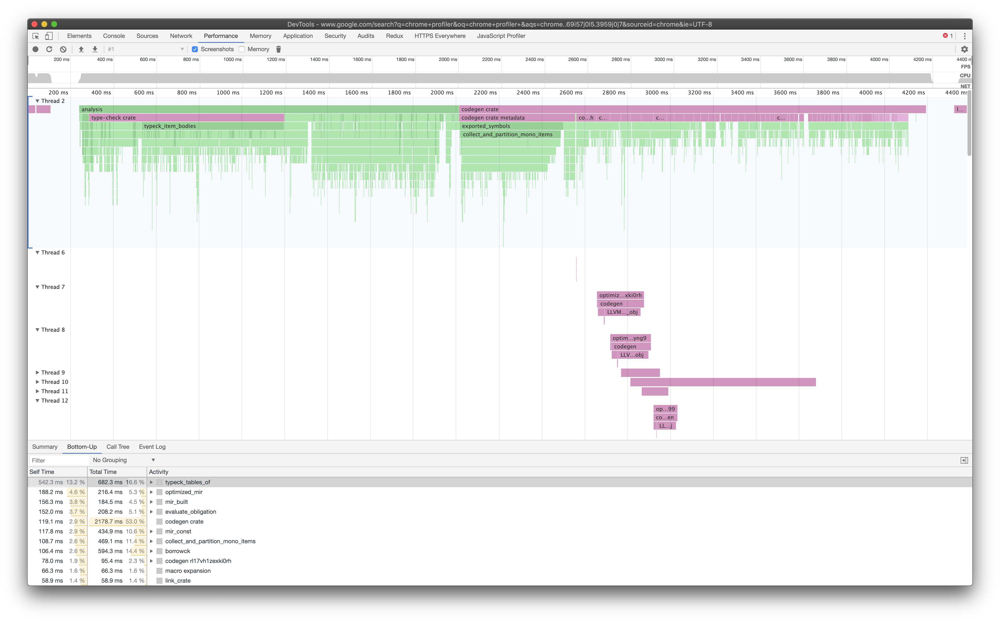

# Crox

Crox (chromium oxide) is a tool to turn trace files from `measureme` into files that can be visualized by the Chromium performance tools.



## Getting started

1. Obtain a sample recorded using `measureme`.
For example, using the self-profiler in `rustc`:

```
$ cargo rustc -- -Z self-profile
```

2. Run `crox` on the output file:

```
$ # Install crox if you haven't done so yet.
$ cargo install --git https://github.com/rust-lang/measureme --branch stable crox

$ crox {crate name}-{pid}.mm_profdata
```

3. Open Chrome

4. Open the Dev Tools console

5. Click the Performance tab

6. Click the Load Profile button

7. Navigate to your working directory and pick `chrome_profiler.json`.
